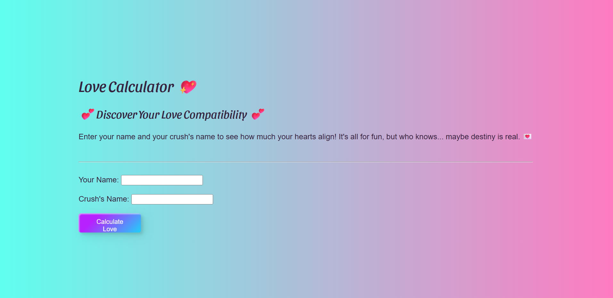

# 💖 Love Calculator 💖

A fun and playful **Love Compatibility Calculator** built with HTML, CSS, and JavaScript.  
Enter your name and your crush’s name to see how much your hearts align!  
It’s all for fun… but who knows, maybe destiny is real. ✨💘

🌐 **Live Demo**: [Try it here!](https://catheringino.github.io/LoveCalculator/)

---

## 📸 Preview


---

## ✨ Features
- 🎯 Simple and intuitive user interface
- 🎨 Beautiful gradient background and styled button
- 💌 Randomized love percentage calculation for entertainment
- 📱 Fully responsive for desktop and mobile devices

---

## 🛠️ Technologies Used
- **HTML5** – Structure of the page
- **CSS3** – Styling and layout
- **JavaScript (Vanilla)** – Functionality and random love score generation

---

## 🚀 How to Use
1. Open the [Love Calculator](https://catheringino.github.io/LoveCalculator/).
2. Enter **your name** and **your crush's name**.
3. Click **"Calculate Love"**.
4. View your **love compatibility percentage** and enjoy the fun result.

---

## 📂 Installation & Setup
If you want to run this project locally:
```bash
# Clone the repository
git clone https://github.com/CatherinGino/LoveCalculator.git

# Open the folder
cd LoveCalculator

# Open index.html in your browser
